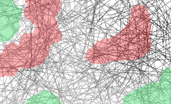

# 數位鏡面-線

> 
> 創作數位影像和繪畫有很大的差別。運用攝影機創作數位影像時，必須反其道而行之。
>
> 若畫面完全沒有經過處理，呈現出來的就是攝影鏡頭下完全寫實的人物影像，但是那很無趣。
>
> -丹尼爾·羅森 Daniel Rozin
> 

這個作品是數位鏡面這個系列的起點，也是我開始寫程式的起點。這個作品是模仿一位藝術家：丹尼爾·羅森(Daniel Rozin)，在機捷 A13(機場第二航廈站) 展出的一個作品。最一開始看到數位鏡面這個作品是在某次出國前，那個時候離旅行社的集合時間還要大約兩個小時，所以我們在這幾面鏡子前待了一段時間。這幾面鏡子給了我一種特殊的感覺，你可以感受到鏡子在跟著你動，但是哪裡動了卻說不出來，我和我弟就這樣待在鏡子前站了好久。回去之後，我便下定決心要把這面鏡子做出來。

胡氏藝術的數位鏡面介紹：[https://www.husart.net/?p=372](https://www.husart.net/?p=372)

文化部的數位鏡面介紹：[https://cloud.culture.tw/frontsite/inquiry/emapInquiryAction.do?method=showEmapDetail&indexId=52441](https://cloud.culture.tw/frontsite/inquiry/emapInquiryAction.do?method=showEmapDetail&indexId=52441)

照片來源：胡氏藝術

## 實現方式

回到家裡後，我決定復刻這些鏡子中的其中一面，那面鏡子是由線條組成的，你可以看到一直有線畫在上面。我認為他的實現方法應該是：

1.  先在照片上畫一條虛擬的線
2.  取照片上被畫到的點
3.  把這些點平均
4.  在畫布上畫出來

基於這幾個步驟，我很快搭建好了第一個程式 V0.0。我使用 Opencv 模組擷取影像，然後用 Turtle 模組畫出來。效果如下：

可以看到，他有在畫。但怎麼說...他有點...太慢了。後續嘗試了許多方法，例如把烏龜的速度調高啦、又或是改用 Pygmae 生成影像、甚至動了想要把他改寫成 C++ 的念頭，但最快就是大概到 30 秒畫出輪廓。但後來發現了一件事，就是他的分布似乎不均勻，

也對，畢竟是隨機取的線嗎。想說讓他至少輪廓出來快一點，所以用了一個雙層 for 迴圈去限定他取數的範圍，讓他可以每個地方都取到數。於是我做了 V1.0，結果他突然變超快，具體效果如下：

這並不是我第一次嘗試用 for 迴圈加速，但以往用 for 迴圈加速並沒有這麼明顯的效果，所以我並沒有採用。

後來我發現在這個程式中存在一個"最佳刷新率"，越接近這個最佳刷新率，視覺效果越好（畫面變化最明顯，且沒有卡頓）。

具體一點來說，可調整的數值有三項： $W$ - 線條寬度 、 $L$ - 線條長度 、 $F$ - for迴圈的切割大小。其中 $W$ 僅對視覺效果作用，對執行速度沒有影響。$L$ 與 $F$ 則會對執行速度造成影響。因此每次循環的時間複雜度可以寫為：

$$LF^2$$

又因為每次循環都會將螢幕刷新一次，因此每次循環的時間越接近人眼的最低分辨率，視覺變化就會越多。若是將人眼最低分辨率設為 $K$，則可列出：

$$\ \lim \limits_{K \to \frac{1}{16}sec}K = LF^2$$

除此之外每台電腦的運算速度會略有不同，因此要在新增一項運算速度常數 $P$ - 電腦運算速度。最終關係式如下：

$$\ \lim \limits_{K \to \frac{1}{16}sec}K = PLF^2$$

在算式之中而 $PLF^2$ 越逼近 $K$ 會有越好的視覺效果。也就是說要追求最好視覺效果的狀況下，其中一項上升，另外兩項則需要降低，反過來也是一樣。

在實際使用中為了達到更好的視覺效果，往往會需要頻繁的更改程式，這就很煩。因此我做了一個有互動面板的版本，使用者可以透過面板快速的調整這三項數值。這也是我展示最多的版本，除了他穩定之外，我也更喜歡這個版本的線條(Pygame)，他比起後面版本(Opencv)的線條更有稜有角，更有個性與未來感。

後來過了許久之後，ChatGPT 出來了。我把它扔進 ChatGPT 後他給了我一個更為精簡的版本（把渲染的部分改成opencv本體），透過 Class 去達成整個操作，也更好搬運。但我沒有很喜歡這個版本

